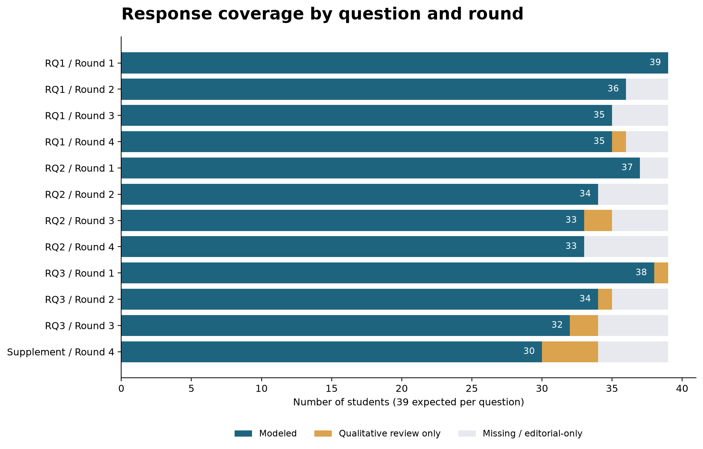
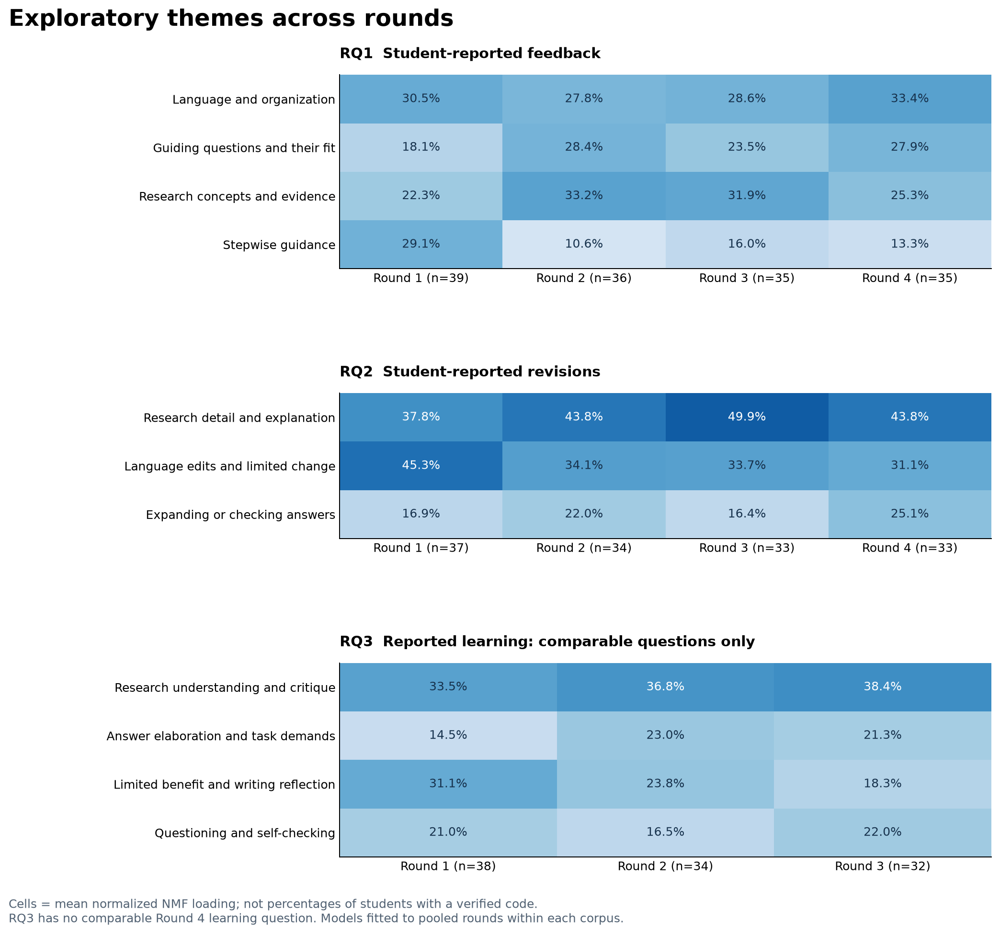
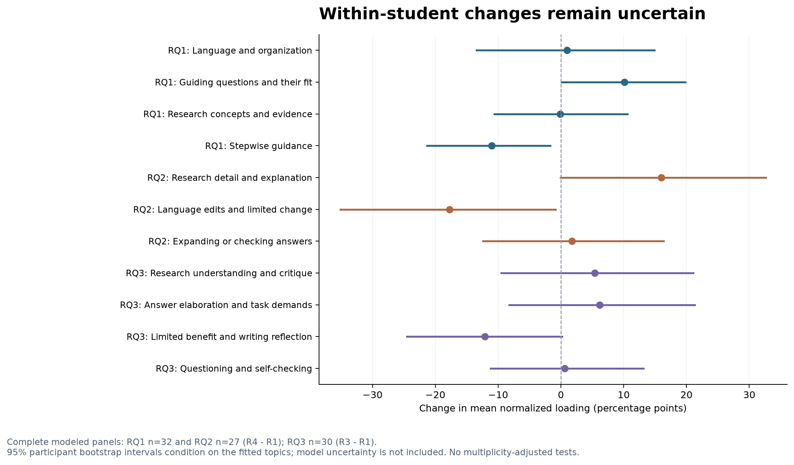
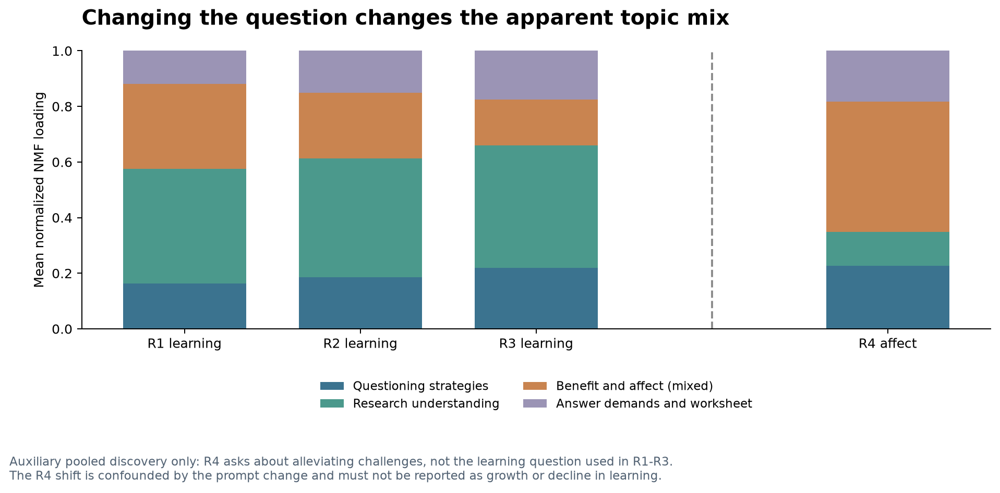
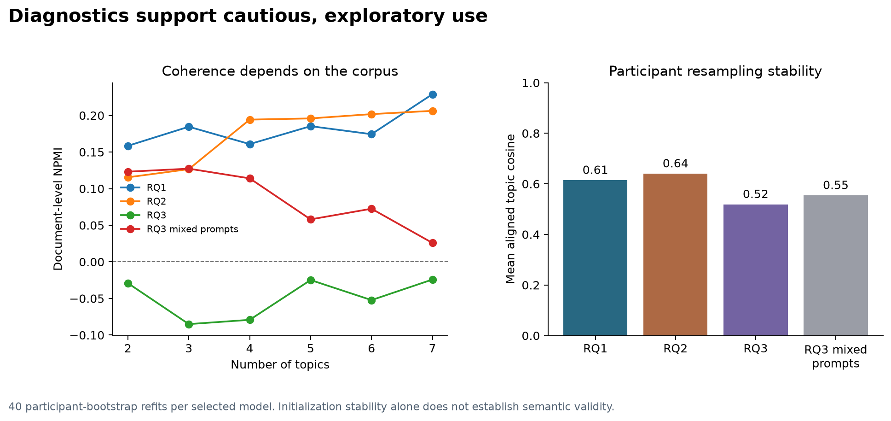

# AI 同伴评阅中的反馈、修订与学习

39名学生四轮反思的探索性分析 · 2026年9月27日

学生使用AI反馈的方式并不一致。有人修改语言和结构，有人补充研究解释，也有人筛选、拒绝建议，或把前轮学到的检查方法用于后续写作。四轮材料呈现了这些差异，却还不足以说明学生沿着同一条路径持续进步。

本报告用主题模型整理文本中的主要线索，为后续开放编码提供依据。分析对象是学生的反思，因此下文讨论的是学生报告的反馈、修订和收获。独立人工编码尚未完成。

## 数据与研究问题

项目共核查112个源文件，包括一份Excel、一份论文草稿和110份匿名反思文档。Excel有41个参与者记录，其中两人没有实质回答，主分析采用其余39人的文本。清理以原始工作表为准，保留缺失、节录和编辑补充的审计记录。

另有28人的匿名文档，共109个不同的参与者与轮次组合，其中一份重复提交。文档日期与Excel元数据不一致，同轮文本匹配的最高相似度约为0.27。两套资料尚无可靠对应关系，本次没有合并。57份PDF使用本地OCR提取，识别文本只用于来源核查。

| 研究问题 | 分析对象 | 可比轮次 |
| --- | --- | --- |
| RQ1：AI提供了哪些反馈？ | 学生报告的反馈内容与形式 | 第一至第四轮 |
| RQ2：学生根据反馈做了哪些修改？ | 学生报告的修订行动 | 第一至第四轮 |
| RQ3：学生学到了什么？ | 学生自述的知识、策略与写作收获 | 第一至第三轮；第四轮作补充 |

前三轮的第三题询问对下一次写作的收获。第四轮的第三题改问过去是否因焦虑等原因避免写作，第四题询问AI是否缓解这些挑战。第四轮只有前两题与前三轮相同，学习收获不能作四轮同题比较。

三个RQ的可比题共应有429条回答，保留393条学生文本，其中386条进入主模型。其余包括34条缺失或不可用标记、2条纯编辑推断；7条有效短答保留供质性复核。加入第四轮补充题后，共有427条有效回答。156个潜在日记时点中，147个至少有一条学生文本。

图中分母均为39人。“有效文本”包括未进入模型的短答。第四轮补充题有34条有效回答，其中30条进入辅助模型。

## 主题与轮次变化

每个RQ先合并可比轮次拟合一个模型，再按轮次汇总。这样，各轮使用同一组主题。RQ1保留4个候选主题，RQ2保留3个，RQ3保留4个。

下表的百分比是平均标准化NMF载荷，表示文本在模型中的相对主题权重。它既不是出现该主题的学生比例，也不是人工编码频率或写作能力得分。

<!-- TOPIC_TABLE:start -->
| 问题 | 候选主题 | 第一轮 | 第二轮 | 第三轮 | 第四轮 |
| --- | --- | --- | --- | --- | --- |
| RQ1 | 语言表达与篇章组织 | 30.5% | 27.8% | 28.6% | 33.4% |
| RQ1 | 引导性问题及其适用性 | 18.1% | 28.4% | 23.5% | 27.9% |
| RQ1 | 研究概念与证据核查 | 22.3% | 33.2% | 31.9% | 25.3% |
| RQ1 | 分步指导与理解支持 | 29.1% | 10.6% | 16.0% | 13.3% |
| RQ2 | 补充研究内容与解释 | 37.8% | 43.8% | 49.9% | 43.8% |
| RQ2 | 语言格式修改及有限修改 | 45.3% | 34.1% | 33.7% | 31.1% |
| RQ2 | 围绕问题补充或核对回答 | 16.9% | 22.0% | 16.4% | 25.1% |
| RQ3 | 研究理解与批判性解释 | 33.5% | 36.8% | 38.4% | 题目不同 |
| RQ3 | 回答展开与任务要求意识 | 14.5% | 23.0% | 21.3% | 题目不同 |
| RQ3 | 有限收获与改变写法的反思 | 31.1% | 23.8% | 18.3% | 题目不同 |
| RQ3 | 提问策略与自我检查 | 21.0% | 16.5% | 22.0% | 题目不同 |
<!-- TOPIC_TABLE:end -->

### RQ1：反馈内容与反馈形式并存

语言表达与篇章组织在四轮都较突出，平均权重约为28%至33%。研究概念与证据核查在第二、三轮较高。分步指导从第一轮的29.1%降至第四轮的13.3%，引导性问题从18.1%升至27.9%。

引导性问题这一主题也包含对问题重复、不适配或缺乏帮助的评价。因此，权重增加只能说明相关表述增加，不能解释为引导质量提高。

### RQ2：内容补充增加，修订类型仍需细分

语言格式修改及有限修改的混合主题从45.3%降至31.1%。补充研究内容与解释在第三轮达到49.9%，第四轮为43.8%。内容解释在后几轮更突出，但变化并不单调。

模型把少量修改、没有修改和语言修改中的部分表述放在同一主题中。人工编码需要进一步区分已经实施的修改、未来计划、核查后保持原稿，以及明确拒绝建议。修改少也可能来自准确判断，不能直接视为投入不足。

### RQ3：有策略线索，尚无稳定增长趋势

前三轮，研究理解与批判性解释的权重从33.5%升至38.4%；有限收获与改变写法的反思从31.1%降至18.3%。提问策略与自我检查分别为21.0%、16.5%和22.0%，没有持续增长的趋势。

这一语料的词共现结构较弱。调整词项过滤或纳入短答后，策略主题的首尾变化会改变方向。因此，策略发展应通过纵向原文和反例检验，不能由这些数值直接推出。

## 同一学生的变化有多大

完整模型面板包含RQ1的32人、RQ2的27人和RQ3的30人。RQ1、RQ2比较第四轮与第一轮，RQ3比较第三轮与第一轮。以学生为单位进行2,000次重抽样，估计首尾配对差的区间。

RQ1分步指导的配对变化约为负11.0个百分点，RQ2语言格式及有限修改约为负17.7个百分点。RQ3各主题的配对变化区间都跨越0。

这些区间以已经拟合的主题为条件，不包含主题定义、主题数和预处理选择的不确定性。本分析没有进行多重比较校正后的显著性检验，也不作因果判断。

五组敏感性分析分别纳入短答、取消“至少两名学生”的词项限制、排除带节录标记的回答、提高至15词阈值，以及删除完全重复文本。RQ1分步指导和RQ2语言修改相关权重的下降方向一致；RQ3策略主题不稳定。

## 第四轮补充了什么

第四轮可以用于讨论非评判性支持、即时回应、信心、写作焦虑，以及策略迁移。阅读时还需要区分实际体验与假设性帮助、没有焦虑基线与焦虑得到缓解。部分回答更像工作表建议或帮助请求，可能偏题或存在转录错位，目前保留原列。

将前三轮学习题与第四轮情绪题合并后，辅助模型中的情绪相关表述在第四轮增加，研究理解相关表述减少。这种变化与提问内容交织在一起，不能作为学生关注点自然转移的证据。

## 方法与模型诊断

建模单位是一名学生在某轮对某题的回答。采用TF-IDF与非负矩阵分解（NMF），使用英文分词、Snowball词干化、一般停用词和通用任务词过滤，以及单词和双词组合。保留至少出现在两条回答、且来自两名不同学生的词项，最大文档频率为85%。没有用理论层级设置种子词。

主模型采用不少于8个英文词且具有有效特征的回答。清理移除了复制题干和明确的编辑推断，没有修正学生原文中的语言或概念错误。有意义的否定和短答保留供人工阅读；停用词处理会削弱否定语义，这也是不能用模型代替语义编码的原因。

每个语料比较2至7个主题、5个随机种子，综合检查重构误差、NPMI、主题词多样性、主题规模和代表原文。RQ2采用较宽的3主题，因为进一步细分时，部分主题主要反映个别学生重复使用的措辞。主题数和标签均为研究者仍需复核的分析选择。

<!-- DIAGNOSTIC_TABLE:start -->
| 语料 | 主题数 | 回答数 | 词项数 | NPMI | 重抽样相似度 |
| --- | --- | --- | --- | --- | --- |
| RQ1 | 4 | 145 | 596 | 0.161 | 0.614 |
| RQ2 | 3 | 137 | 449 | 0.127 | 0.640 |
| RQ3 | 4 | 104 | 319 | -0.079 | 0.519 |
| 混合题目辅助模型 | 4 | 134 | 390 | 0.114 | 0.554 |
<!-- DIAGNOSTIC_TABLE:end -->

NMF主题向量先归一到相同L2长度，同时调整文档载荷，再把每条回答的载荷标准化为和为1的相对权重。主题稳定性通过40次参与者重抽样、重新拟合和主题对齐评估。这里保留原词表，评估的是固定特征空间内的主题恢复。

三个主模型的平均对齐相似度约为0.61、0.64和0.52，说明样本构成会影响结果。RQ3的NPMI为负，主题标签尤其需要原文复核。NNDSVD初始化下不同种子收敛相近，也不意味着主题具有语义效度。

## 理论解释与人工复核

学生反馈素养可以作为开放编码之后的解释框架。Carless与Boud（2018）讨论理解反馈价值、形成判断、管理情绪和采取行动。这些维度能够解释材料中对建议的理解、选择、拒绝和使用。当前分析没有测量反馈素养，也不能声称验证了其增长。[文献](https://doi.org/10.1080/02602938.2018.1463354)

自我调节学习可以补充过程解释。提前开始、重复阅读、自我提问、检查原文和跨轮沿用策略，分别涉及计划、监控和调节。Nicol与Macfarlane-Dick（2006）对学生主动生成和使用反馈的讨论适合这一方向。未来意向仍需与已经发生的行为分开。[文献](https://doi.org/10.1080/03075070600572090)

Hattie与Timperley（2007）的任务、过程、自我调节和自我层面描述反馈指向，不构成可直接套用于学生修订的升阶量尺。学生报告更有信心，也不等于收到指向个人的自我层面反馈。[文献](https://doi.org/10.3102/003465430298487)

现已整理36个候选代码，以及覆盖427条回答的475个阅读片段。公开代码本只包含定义和边界；原话、个体定位与复核记录保留在本地。候选代码由AI辅助起草，尚未经过独立人工编码，不能作为已验证的主题或频数。

建议两位研究者先跨轮独立阅读，形成开放码并讨论分歧，再按轮次汇总。编码允许一段多码，尤其保留负面、模糊和无变化案例。RQ2需标记行为是否已经发生，以及修改归因于AI、人类、自身还是其他工具；RQ3需区分知识、写作原则、使用策略、批判判断、情绪与迁移。

代码定义稳定后，可报告每轮至少出现一次某代码的学生数，以该题有效回答人数为分母。缺失不补0，多码比例之和可以超过100%。是否报告编码一致性，应与所选质性分析方法一致。

## 资料与复现

仓库提供分析代码、参数、汇总CSV、候选代码本和五张图。网页与图表可直接从公开汇总数据重建；重新拟合模型需要获得授权的原始Excel。本仓库不提供学生逐条回答、匿名日志、个体载荷、模型因子或内部人工复核表。

尚待核实的事项包括两套资料的对应关系、转录中的节录与推断规则，以及少数回答的列分配。现有材料也不足以核验全体学生的实际AI输出和前后稿变化。工具使用存在差异，不能假定所有学生使用同一个模型版本。

报告中的解释来自计算结果与AI辅助阅读。研究者仍需核查代码、原文和理论对应关系，之后才能形成论文中的最终主题。

计算方法参考：[scikit-learn主题提取示例](https://scikit-learn.org/stable/auto_examples/applications/plot_topics_extraction_with_nmf_lda.html)；Chang等（2009），[Reading Tea Leaves](https://proceedings.neurips.cc/paper/2009/hash/f92586a25bb3145facd64ab20fd554ff-Abstract.html)；Belford、Mac Namee与Greene，[Stability of Topic Modeling via Matrix Factorization](https://arxiv.org/abs/1702.07186)。
